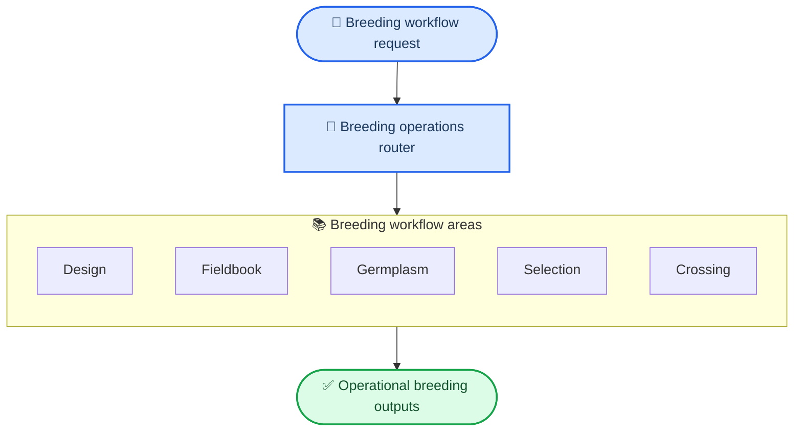
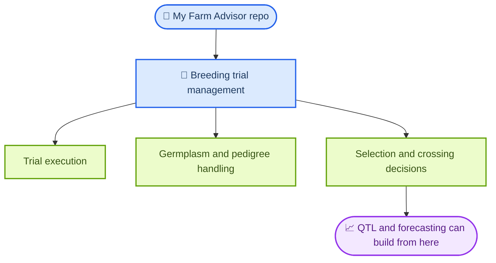

# My Farm Breeding Trial Management

My Farm Breeding Trial Management is the breeding-operations skill pack for this repo. It covers how breeding programs move from experimental design to fieldbooks, germplasm handling, selection decisions, and crossing plans.

Use this skill when the problem is operational breeding work rather than farm-wide advisory routing or downstream QTL interpretation.

## What This Skill Does

- Plans breeding trials with common experimental designs like RCBD, alpha-lattice, and augmented layouts.
- Generates fieldbooks and operational plot artifacts for field crews.
- Organizes germplasm, pedigree, and accession workflows.
- Supports ranking, shortlist generation, and selection-index style decisions.
- Builds crossing and mating-plan scaffolds for the next breeding cycle.

## How It Runs

The skill revolves around a unified breeding CLI and example modules that map to the core phases of breeding operations.

## Core Workflow Areas

| Area      | What it covers                                     | Typical result                            |
| --------- | -------------------------------------------------- | ----------------------------------------- |
| Design    | Trial layout planning and experimental structure   | RCBD, alpha-lattice, or augmented designs |
| Fieldbook | Plot sheets, labels, and field execution artifacts | crew-ready fieldbook outputs              |
| Germplasm | Accession and pedigree handling                    | organized breeding material records       |
| Selection | Ranking and shortlist generation                   | candidate line decisions                  |
| Cross     | Crossing plans and mate pairing                    | next-cycle crossing scaffold              |

## Breeding Program Flow

```mermaid
flowchart LR
    accTitle: Breeding Program Cycle
    accDescr: Typical breeding-program flow from objective setting through design, fieldbook generation, germplasm context, selection, and crossing for the next cycle.

    intake([🎯 Set breeding objective]) --> design_step[Choose design]
    design_step --> fieldbook_step[📒 Generate fieldbook]
    fieldbook_step --> germplasm_step[🧬 Capture germplasm context]
    germplasm_step --> selection_step[Select promising lines]
    selection_step --> cross_step[🌿 Build crossing plan]
    cross_step --> next_cycle([🔁 Prepare the next cycle])

    classDef primary fill:#dbeafe,stroke:#2563eb,stroke-width:2px,color:#1e3a5f
    classDef process fill:#fef3c7,stroke:#d97706,stroke-width:2px,color:#78350f
    classDef outcome fill:#dcfce7,stroke:#16a34a,stroke-width:2px,color:#14532d

    class intake primary
    class design_step,fieldbook_step,germplasm_step,selection_step,cross_step process
    class next_cycle outcome
```

## Example Modules Included

- Trial design: `examples/rcbd-design/`, `examples/alpha-lattice/`, `examples/augmented-design/`, `examples/field-book/`
- Germplasm and pedigree: `examples/breedbase-client/`, `examples/pedigree-management/`, `examples/bms-client/`
- Selection and crossing: `examples/selection-index/`, `examples/breeding-value-ranking/`, `examples/crossing-plan/`, `examples/data-import/`
- Field systems integration: `examples/iot-field-sync/`
- Simulation support: `examples/breeding-simulation/`

## Why It Matters In This Repo

This skill is the operational breeding layer. It is what you use before or alongside QTL analysis when the work is about running breeding programs, not only analyzing marker-trait associations.

## Start Here

- Main entrypoint: [`SKILL.md`](SKILL.md)
- Unified CLI examples in `SKILL.md`
- Trial design examples: [`examples/rcbd-design/`](examples/rcbd-design/)
- Selection and crossing examples: [`examples/selection-index/`](examples/selection-index/) and [`examples/crossing-plan/`](examples/crossing-plan/)
- Simulation notes: [`examples/breeding-simulation/README.md`](examples/breeding-simulation/README.md)
