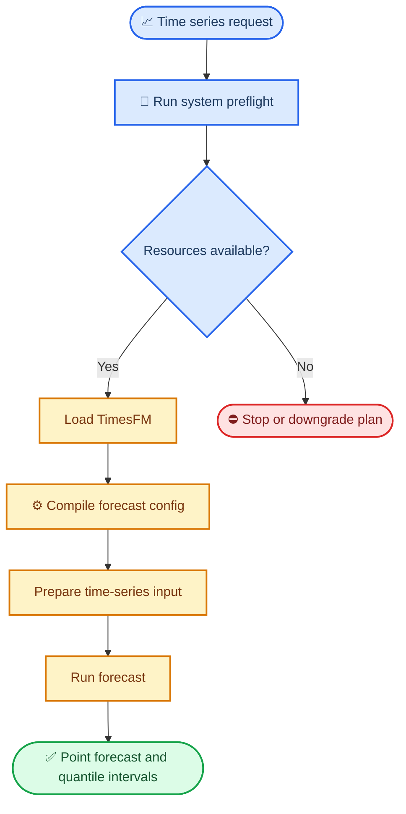
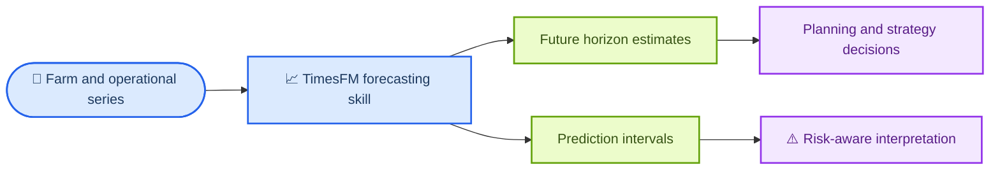
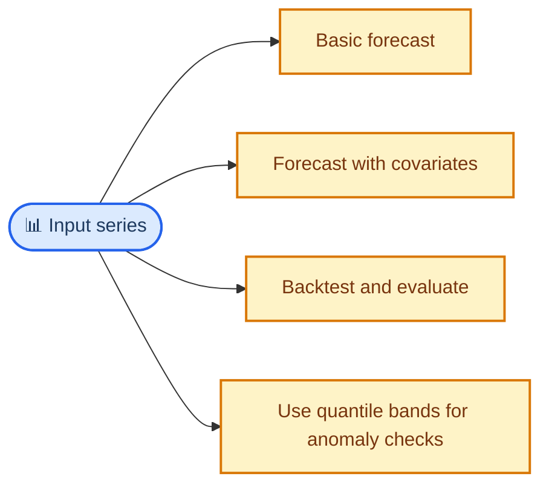

# Superior Byte Works Google TimesFM Forecasting

Superior Byte Works Google TimesFM Forecasting is the foundation-model forecasting skill pack for this repo. It wraps Google's TimesFM time-series model in a safer, agent-friendly workflow that checks hardware first, supports zero-shot forecasting, and produces both point forecasts and prediction intervals.

Use this skill when you need forecasting on univariate time series and you want a strong foundation-model baseline without training a custom model first.

## What This Skill Does

- Runs zero-shot forecasting on many kinds of time series without training a bespoke model.
- Forces a preflight system check before model loading so the workflow does not crash weak machines.
- Supports point forecasts plus quantile-based uncertainty bands.
- Covers common patterns like CSV forecasting, covariate-aware forecasting, anomaly screening via intervals, and evaluation.
- Gives the repo a modern forecasting tool that complements farm strategy and breeding workflows.

## Forecasting Workflow

The mandatory preflight check is part of what makes this skill useful in a real agent system. It avoids loading a large model blindly on machines that cannot handle it.

## Core Capability Areas

| Area                  | What it covers                                 | Typical output                      |
| --------------------- | ---------------------------------------------- | ----------------------------------- |
| Preflight             | RAM, GPU, disk, and install readiness          | go/no-go decision before model load |
| Zero-shot Forecasting | univariate forecasting without custom training | point forecast arrays               |
| Prediction Intervals  | quantile-based uncertainty ranges              | lower and upper bands               |
| Covariate Forecasting | exogenous-driver workflows for TimesFM 2.5+    | adjusted forecasts                  |
| Anomaly Screening     | unusual-value detection from quantile bands    | warning and critical flags          |
| Evaluation            | holdout and accuracy checks                    | MAE, RMSE, coverage summaries       |

## How It Fits In This Repo

This skill complements the rest of the repo by handling the forecasting layer. It is not the whole farm advisory system by itself; it is the forward-looking time-series engine you use when you need probabilistic outlooks.

## Typical Usage Patterns

Typical examples:

- demand or supply outlooks
- weather or climate trajectories
- sensor or operational trend forecasting
- anomaly screening using forecast intervals
- fast baseline forecasts before building a classical model

## Key Strengths

- fast path to useful forecasting
- probabilistic outputs rather than a single blind point estimate
- safe machine-checking before inference
- good fit for agent workflows because it can reason about readiness, forecast, and uncertainty together

## Start Here

- Main entrypoint: [`SKILL.md`](SKILL.md)
- Preflight requirement and quick start live in `SKILL.md`
- Examples live under `examples/`, including `examples/global-temperature/`
- Use this before moving to more specialized classical time-series tooling when zero-shot forecasting is enough
